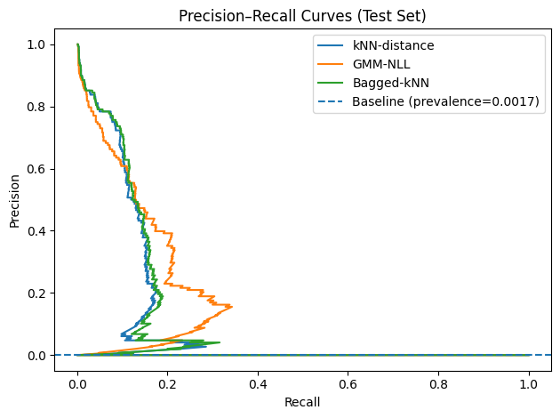
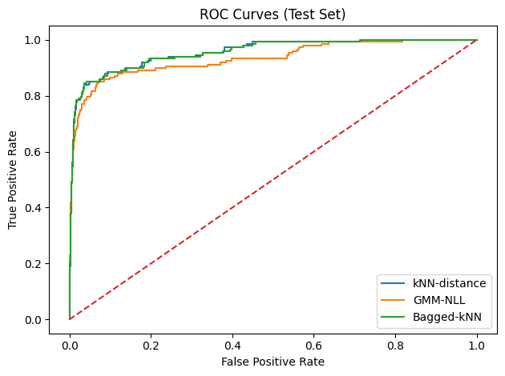

## Research Questions

1.  How well do unsupervised ensemble-based models detect fraudulent transactions when labels are withheld during training?
2.  How do distance-based and statistical approaches to outlier detection compare to ensemble-based methods in identifying rare but meaningful anomalies?

## Data

-   [Credit Card Fraud Detection](https://www.kaggle.com/datasets/mlg-ulb/creditcardfraud) dataset (European cardholders, **2013**, two days).
-   **284,807** transactions; **492** labeled fraud (≈0.172%).
-   Features: **V1–V28** (anonymized via PCA), **Time** and **Amount**.
-   Labels (**Class**) withheld during training; used only for evaluation.

## Models & Scoring

-   Ensemble-based: Bagged-kNN — 25 bags, 70% subsamples, each bag computes kNN distance (k = 20); scores are averaged to reduce variance.

-   Distance-based: kNN distance (k = 20) — anomaly score is the distance to the k-th neighbor.

-   Statistical: Gaussian Mixture Model (GMM) — n_components = 3, covariance = full; anomaly score is negative log-density via -score_samples

## Evaluation Table

|        Model | ROC-AUC  |  PR-AUC  |   Precision@n   |
|-------------:|:--------:|:--------:|:---------------:|
| kNN-distance | 0.955179 | 0.111211 |      0.169      |
|   Bagged-kNN | 0.954860 | 0.118200 |      0.189      |
|          GMM | 0.932977 | 0.137379 |      0.223      |

## Plots

{fig-align="center" width="750"}

## Plots (cont.)

{fig-align="center" width="750"}

## Images used

{fig-alt="https://www.google.com/imgres?q=credit%20card%20hackers&imgurl=https%3A%2F%2Fwww.publicdomainpictures.net%2Fpictures%2F390000%2Fnahled%2Fonline-fraud.jpg&imgrefurl=https%3A%2F%2Fwww.publicdomainpictures.net%2Fen%2Fview-image.php%3Fimage%3D386625%26picture%3Donline-fraud&docid=6yMSH94Ztu2QyM&tbnid=9j8JqL4y_Te9kM&vet=12ahUKEwiMwbyh-piPAxX2D0QIHRm2OqYQM3oECBYQAA..i&w=615&h=416&hcb=2&ved=2ahUKEwiMwbyh-piPAxX2D0QIHRm2OqYQM3oECBYQAA" fig-align="center" width="500"}